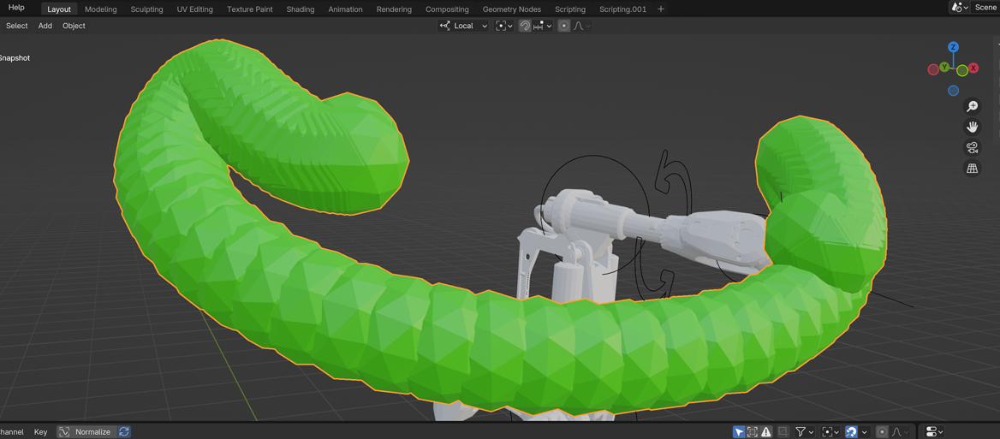

# **Animation Snapshot Tool**
Snapshots the selected animated objects over a given frame range and interval  

*Fig 1: Screenshot of a combined snapshot*

## *Install the Add-on* 
- Download a zip of the repo from Github: **Code --> Download Zip**
- In Blender Go to: **Edit --> Preferences --> Add-ons --> Down Arrow (Upper Right Menu Corner) --> Install From Disk...**

## *Script Version* 
If you don't want to install the full add-on, you can run a simplified version of the snapshot tool from the Scripting Panel. 
- Load the *blender_snapshot.py* file
- Adjust the parameters (start/end frames, selected objects) as needed 

## *Operation Guide* 
**Please note:** *This tool only works on meshes at this time. It does not work on curves unless converted to a mesh.* 
- To use a curve object convert to mesh: (*In Object Mode*) **Object --> Convert --> Mesh**
- Open the Snapshot Panel. This will load on the righthand side of the viewport window. The hotkey to load the panel is **N.**
- Set the desired frame range and frame interval
- Select the mesh or meshes you wish to snapshot. *If nothing is selected, nothing will be saved* 
- Press *"Run Snapshot Process"* to duplicate your meshes. They will appear in a new collection named **Snapshot Meshes**.
- To combine these meshes into a single object, press the **Combine Snapshots** button.
- If you would like to keep the seperate meshes in addition to the combined mesh, toggle **Keep Seperated Meshes** before pressing **Combine Snapshots.**

##
Reach out if you have questions. @camkania on socials
